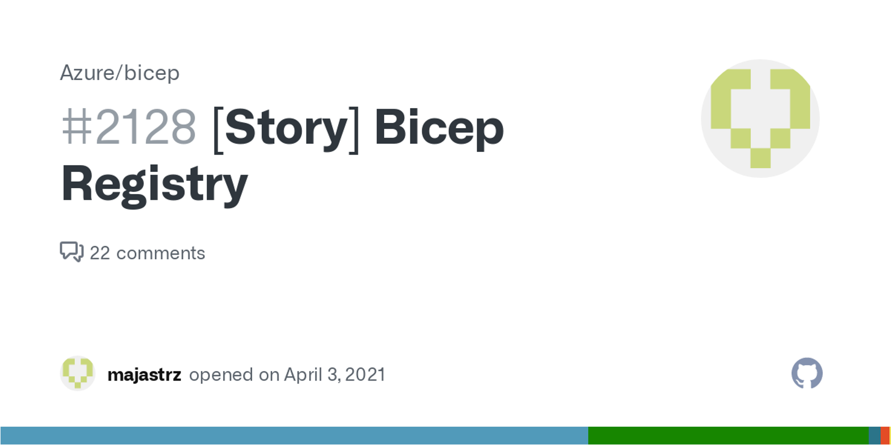

## TL;DR

Lerna, a tool optimizing the multi-package (monorepo) repositories, is an ideal candidate to offload the complexity a bicep monorepo brings.

## Bicep registry support

Registry support was quite a hot topic during the development of [Bicep](https://docs.microsoft.com/en-us/azure/azure-resource-manager/bicep/overview).



      

             
      

      

            

                  Personnaly I'm quite exited OCI registry support was choosen above a git based or any other package management solution. A <a href="https://github.com/Azure/bicep/issues/660">suggestion</a> I pitched in the during the early discussions.
            

      

  



Embracing OCI support brings, but not limited to, the following (opinionated) benefits:

- Near deployment availability
- supports customer network egress rules
- Aligns with a cloud-native approach, that CNAB and Helm are taking
- Broad adoption in cloud, and not linked to a certain technology, whether this a development technology or technology resource.
- Support for immutable packages

Bicep version 0.4.1008 brought private registry support.
Creating a registry, referencing modules and publishing and restoring is well documented.  
Check out docs.microsoft.com for more information (see below)! 

Bicep module registry support is quite exciting as it enables organizations to share modules across teams. A huge step forward in limiting 're-inventing the wheel' and enabling ['innersourcing'](https://en.wikipedia.org/wiki/Inner_source#:~:text=InnerSource%20is%20the%20use%20of,in%202000%20in%20his%20column.) within your organization.

> A module is a container for multiple resources that are used together. Modules can be used to create lightweight abstractions, so that you can describe your infrastructure in terms of its architecture, rather than directly in terms of physical objects.

The usage of modules is wel documentated and can be found on docs.microsoft.com. Below you can find a list of usefull resources to get started.

- [Create a private registry](https://docs.microsoft.com/en-us/azure/azure-resource-manager/bicep/private-module-registry?tabs=azure-powershell)
- [Reference modules in a registry](https://docs.microsoft.com/en-us/azure/azure-resource-manager/bicep/modules#file-in-registry)
- [Publish](https://docs.microsoft.com/en-us/azure/azure-resource-manager/bicep/bicep-cli#publish) and [restore](https://docs.microsoft.com/en-us/azure/azure-resource-manager/bicep/bicep-cli#restore) commands
- [Adding registry aliases via bicepconfig.json](https://docs.microsoft.com/en-us/azure/azure-resource-manager/bicep/bicep-config-modules#aliases-for-modules)

### The repo sprawl

The management of modules automatically brings up questions concerning repository management.

Should we, and this is a common approach in other technologies - like terraform - accept that a module has a 1:1 relation to its repository?  
This particular question pops more often up than one thinks. The smaller your services (and modules) become, the more repo sprawl you'll encounter.  
I will try not go too much into the debate of mono-repo's versus multi-repo, but in case of an Infrastructure-as-Code (IaC) modular design it might make sense as a single repository establishes a centralized place to collaborate, track features and issues. It enhances the visibility across teams of all embraced IaC components supported by your organization.

As an illustration says more then words;


<table>
<tr>
      <td>
            
      </td>
      <td>
            
      </td>
      <td>
            
      </td>
      <td>
            
      </td>
</tr>
</table>


## Monorepo leveraging OSS tooling

When discussing modules and ARM template re-usability you would naturaly discover the [Azure Quickstart templates](https://github.com/Azure/azure-quickstart-templates), as I did.

The repo itself also, like a mono-repo, brings together multiple templates and bicep modules. But in all honesty, it feels overwelming and chaotic.  
At the same time it introduces quite some custom scripts to maintain the different packages, only increasing the operational burden.

This got me wondering... How do other tech companies solve this?
What does Spotify, Google or Twitter or the javescript community use?

## What are we going to do?

We will create a mono-repo that contains 2 bicep packages. After making changes to any of the modules we will commit them following the conventional commits specification.

After making the changes, we'll use Lerna for analyzing the commit history and detecting package (module) changes and the determining the versions that have to be bumped and publishing to the OCI compatible Azure container registry.

### Introducing lerna

lerna.



- It’s all about JSON
- Lerna.json
- Package.json
- Independent versioning
- But publishing ;-(

the sample repo used for during this blog post is available on GH.

#### interesting commands

lerna changed

lerna version

## Getting hands-on

### Setting up the repo

First things first, let's create a repository on Github and 

#### a word on conventional commits

Changelogs with structured info

## Building a Github actions pipeline

Creating a GH actions pipeline and anticipating on the lerna publish specifics.

#### Creating the yaml pipeline

To get started with Github Actions we need to provide some basic info.

1. Define the trigger (on:)
2. Specify additional permissions  - more on that later
3. Define a [job](https://docs.github.com/en/actions/learn-github-actions/understanding-github-actions#jobs). A set of steps executed in order.

This would result in something like below. The File should be saved under the `.github/workflows` directory in your project



In addition to the [workflow](https://docs.github.com/en/actions/learn-github-actions/understanding-github-actions#workflows) definition we will be working against our git repository.
This implies that our first step would fetch our code. 
A step can run an [action](https://docs.github.com/en/actions/learn-github-actions/understanding-github-actions#actions), a custom application, as seen below to checkout the repository.



#### Setup NodeJS

Next we need to setup NodeJS, specifying the version number.



#### Authenticating against Azure

Up next we will be authenticating against Azure using the `Azure CLI login` action. The authentication flow below uses OpenID Connection integration (oidc). A way to allow Github Actions to access resources without needing to store Azure credentials.

Info on how to configure Azure to trust GH OIDC as federated identity is available on [docs.github.com](https://docs.github.com/en/actions/deployment/security-hardening-your-deployments/configuring-openid-connect-in-azure).



#### Version and publish



#### Full pipeline
Now that  we completed all steps, the basic pipeline should look like below.



### End-to-end flow

a screencapture of the end to end flow

1. push change to module in repo
2. trigger pipeline
3. verify repo changes
4. acknowledge repo version bump

### Repository improvements

As this post purely serves to demonstrate the use of [Lerna](https://lerna.js.org/) with bicep, or any non-javascript language for that matter, there is plenty of room for improvement.  
Some ideas might include: 



  <ul style="list-style-type: '- ';">
            <li>versioning pre-release packages</li>
            <li>immutable packages (locking OCI artifacts)</li>
            <li>include ARM templates</li>
            <li>package promotion in ACR</li>
            <li>Code owner for review, etc</li>
  </ ul>
  

  

  

